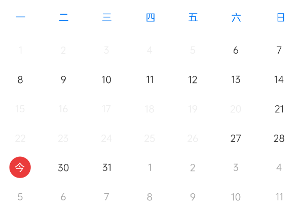

# CalendarView
自定义日历  
1.单选  
2.时间段选择  
# Fix 2022.8.29.1  
新增选中区间图形属性；  
新增水平滑动切换上下月；  
新增垂直滑动切换上下月；  
新增移动距离促发条件absMove属性；  
新增月份滑动方式monthMode属性； 
新增日历月份滑动监听OnCalendarChangeListener；  
新增日历滑动监听OnCalendarScrollChangeListener；  
删除attr.xml中absMove属性；  
优化垂直水平滑动算法；  
新增禁用时间max参数setDisableMinTime()；  
新增禁用时段min参数setDisableMinTime();  
修改item点击事件名称；  
单选监听月份bug修复；  
设置年份、月份、自动促发onCalendarChange监听事件；  
新增设置月份是否可滑动方法;  
新增设置item是否可点击方法;  
新增设置禁用区间数组;  
新增todayText属性设置当前日期文字；  
# 预览
1.单选  
  
2.时段效果 - intervalShape=“circle”  
  
3.时段效果 - (注意：2022.3.30.1版本以前不支持) - intervalShape=“rect”  
  
3.今日效果 - todayText=“今”  
  
# 资源
|名字|资源|
|-|-|
|AAR|[calendar_view.aar](https://github.com/RelinRan/CalendarView/blob/master/calendar_view_2022.8.11.1.aar)|
|GitHub | [CalendarView](https://github.com/RelinRan/CalendarView)|
|Gitee|[CalendarView](https://gitee.com/relin/CalendarView)|
# Maven
1.build.grade | setting.grade
```
repositories {
	...
	maven { url 'https://jitpack.io' }
}
```
2./app/build.grade
```
dependencies {
	implementation 'com.github.RelinRan:CalendarView:2022.8.29.1'
}
```
# xml
```
<com.androidx.widget.CalendarView
    android:id="@+id/calendar"
    android:layout_width="match_parent"
    android:background="@android:color/white"
    app:intervalShape="rect"
    android:layout_height="320dp"/>
```
# attr.xml
```
<!--年份-->
<attr name="initYear" format="integer" />
<!--月份-->
<attr name="initMonth" format="integer" />
<!--日-->
<attr name="initDay" format="integer" />
<!--是否选择时段-->
<attr name="isInterval" format="boolean" />
<!--是否显示当前日期-->
<attr name="showToday" format="boolean" />
<!--周文字大小-->
<attr name="weekTextSize" format="dimension|reference" />
<!--日文字大小-->
<attr name="monthDayTextSize" format="dimension|reference" />
<!--选择圆圈半径-->
<attr name="circleRadius" format="dimension|reference" />
<!--周文字颜色-->
<attr name="weekTextColor" format="color|reference" />
<!--上个月日文字颜色-->
<attr name="lastMonthDayTextColor" format="color|reference" />
<!--当前月日文字颜色-->
<attr name="nowMonthDayTextColor" format="color|reference" />
<!--下个月日文字颜色-->
<attr name="nextMonthDayTextColor" format="color|reference" />
<!--当前日圆圈颜色-->
<attr name="nowDayCircleColor" format="color|reference" />
<!--选中日圆圈颜色-->
<attr name="checkDayCircleColor" format="color|reference" />
<!--选中日区间圆圈颜色-->
<attr name="checkDayIntervalColor" format="color|reference" />
<!--不可用文字颜色-->
<attr name="disableTextColor" format="color|reference" />
<!--区间选中图形类型-->
<attr name="intervalShape" format="enum">
    <!--圈圈-->
    <enum name="circle" value="1"/>
    <!--矩形-->
    <enum name="rect" value="2"/>
</attr>
<!--月份滑动方式-->
<attr name="monthMode" format="enum">
    <!--水平-->
    <enum name="horizontal" value="1" />
    <!--垂直-->
    <enum name="vertical" value="2" />
</attr>
```
# 设置月份是否可滑动
```
CalendarView calendar = findViewById(R.id.calendar);
calendar.setMonthScrollable(true);
```
# 设置item是否可点击
```
CalendarView calendar = findViewById(R.id.calendar);
calendar.setItemClickable(true);
```
# 单选
```
SimpleDateFormat dateFormat = new SimpleDateFormat("yyyy-MM-dd");
CalendarView calendar = findViewById(R.id.calendar);
//设置当前时间
calendar.setDate(new Date());
//单选
calendar.setInterval(false);
//选中日期
calendar.setCheckTime("2022-06-20");
//设置可选区间
calendar.setMinTime("2022-06-01");
calendar.setMaxTime("2022-07-20");
//选中监听
calendar.setOnItemSelectListener((calendarView, time) -> {
    String date = dateFormat.format(time);
});
```
# 时段选择
```
SimpleDateFormat dateFormat = new SimpleDateFormat("yyyy-MM-dd");
CalendarView calendar = findViewById(R.id.calendar);

//设置当前时间
calendar.setDate(new Date())

//时段选择
calendar.setInterval(true);

//设置选中区间
calendar.setIntervalStart("2022-06-20");
calendar.setIntervalEnd("2022-07-05");

//设置可选区间（注意可用和禁用只能设置一种）
calendar.setMinTime("2022-06-01");
calendar.setMaxTime("2022-07-20");

//设置禁用区间（注意可用和禁用只能设置一种）
calendar.setDisableMinTime("2022-05-01");
calendar.setDisableMaxTime("2022-05-20");

//设置禁用区间数组最小（注意可用和禁用只能设置一种）
calendar.setDisableMinTimes(new String[]{"2022-05-01","2022-05-10","2022-05-22"});
//设置禁用区间数组最大（注意可用和禁用只能设置一种）
calendar.setDisableMaxTimes(new String[]{"2022-05-20","2022-08-15","2022-05-26"});

//选择监听
calendar.setOnIntervalSelectListener((view, start, end) -> {
    String startTime = dateFormat.format(start);
    String endTime = dateFormat.format(end);
});
```
# 滑动月份监听
```
CalendarView calendar = findViewById(R.id.calendar);
//日期改变监听
calendar_view.setOnCalendarChangeListener((calendarView, date) -> {
    String text = new SimpleDateFormat("yyyy-MM-dd").format(date);
});
```
# 日历滑动监听
```
CalendarView calendar = findViewById(R.id.calendar);
//滑动监听监听
calendar_view.setOnCalendarScrollChangeListener((view, scrollX, scrollY, oldScrollX, oldScrollY) -> {

});
```
